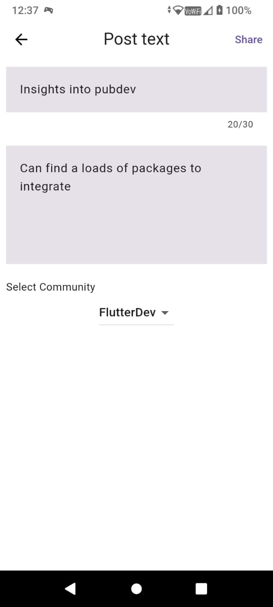

---

### CommunityX - Responsive Social Media Application

**Technologies:** Flutter, Firebase, Riverpod 2.0

**Description:**
Developed CommunityX, a responsive social media application using Flutter and Firebase. The app features user authentication, community management, post interactions, and theming capabilities. 
**Key Contributions:**

- **User Authentication:**
  - Implemented Google Sign-In and guest login functionalities.
  - Managed user-specific features based on authentication status.

- **Community Management:**
  - Enabled creation and management of user communities.
  - Developed features to edit community details and user profiles.

- **Post Interaction:**
  - Designed functionalities for sharing, upvoting, downvoting, commenting, and deleting posts.
  - Incorporated moderator-specific features for community management.

- **Theming and Responsiveness:**
  - Implemented dark mode and light mode toggling.
  - Ensured responsive design for accessibility across multiple platforms.

- **Technical Implementation:**
  - Designed responsive UI using Flutter.
  - Managed routing and navigation within the application.
  - Integrated Firebase for backend services and database management.
  - Utilized Riverpod 2.0 for efficient state management.

## Screenshots

Here are some screenshots of the CommunityX application:

---
